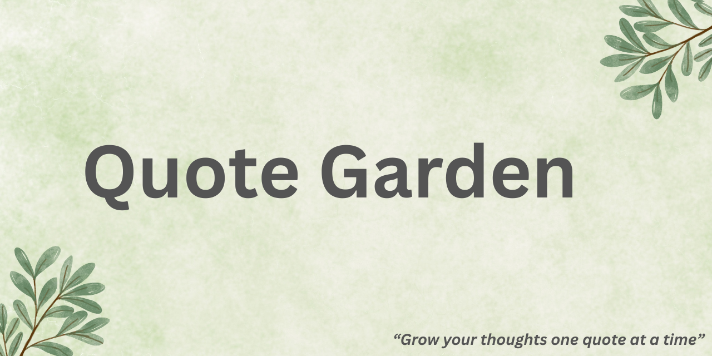

# 🌿 Quote Garden

Quote Garden is a sticky-note-inspired web app that displays motivational quotes with a playful and calming design. Built using **HTML, CSS, and JavaScript**, it includes multiple view modes, a typing effect, dark mode, favorites, and a soothing garden aesthetic to lift your mood.

---

## ✨ Features

- 🎲 **Random quote display** with typing animation
- 💾 **Favorites** — Save and revisit quotes you love
- 🌗 **Light/Dark mode** with theme-based sticky note colors
- 🗂️ **Grid view** for browsing multiple quotes at once
- 🎨 Color-changing quote cards for each new tap
- 🧠 Handwritten font style for a natural look
- 💾 Persistent Preferences: Remembers your last selected theme and dark mode using localStorage.
- 📂 Export: Save your favorite quotes as TXT or PDF files.
- 🔔 Daily Quote Reminder: (Optional feature for future updates).
- 🎨 Themes: Choose between multiple backgrounds — Garden, Notebook, Gradient, Starry Night,and more.
- 📱 Fully responsive and mobile-friendly

---

## 🔗 Demo

👉 [Live Demo](https://meamae-space.github.io/Quote-Garden/)  
Hosted with GitHub Pages

